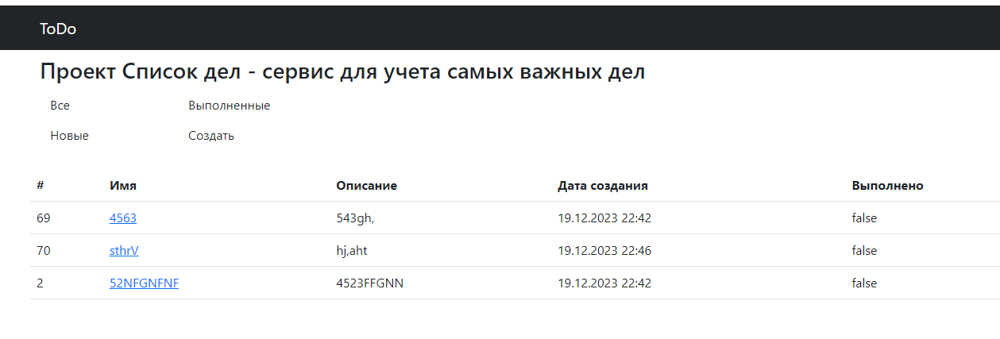
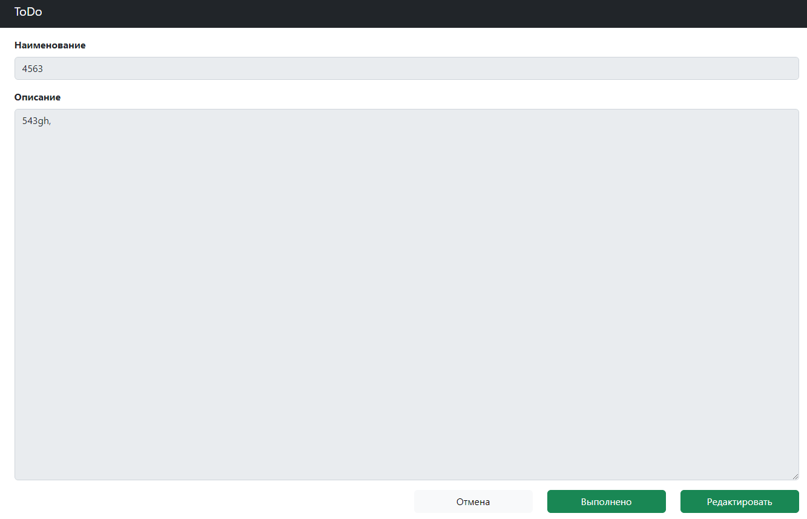
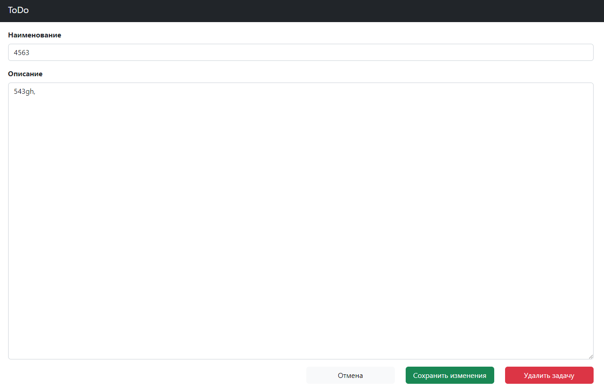
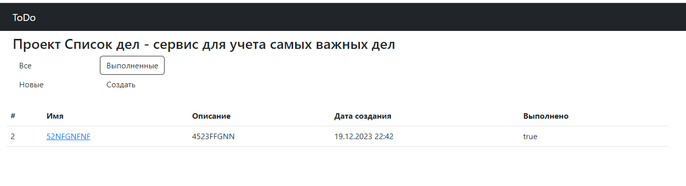
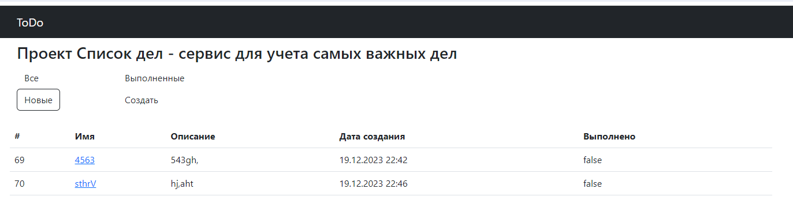

# **Приложение "TODO список"**

## _Описание:_

Приложение для отслеживания и учета важных задач. 
Благодаря нему Вы не забудете про самое важное!

## _Стек технологий:_
Spring boot 

Thymeleaf 

Bootstrap 

Hibernate

PostgreSql

## _Требования к окружению:_
Java 17
Maven 3.8
PostgresSQL 14

## _Запуск проекта:_
Для иницаилизации проекта необходимо выполнить команды:
создание схемы БД:

```create database todo;```

Запуск проекта:

```mvn spring-boot:run```


## _Взаимодействие с приложением:_
Главная страница

Просмотр задачи

Редактирование задачи

Фильтр по выполненным задачам

Фильтр по новым задачам

## _Контакты разработчика:_
### **dafonichkin@gmail.com**